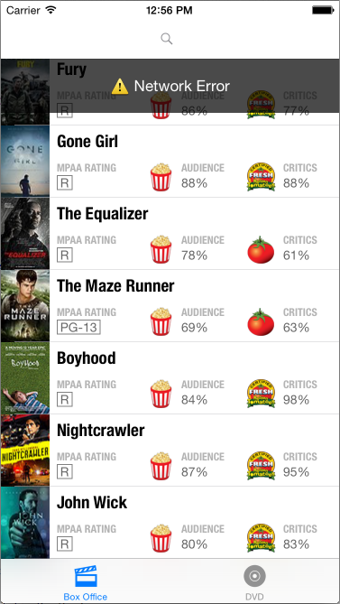

## Rotten Client

This is a movies app displaying box office and top rental DVDs using the [Rotten Tomatoes API](http://developer.rottentomatoes.com/docs/read/JSON).

Time spent: `18hrs`

### Features

#### Required

- [x] User can view a list of movies. Poster images load asynchronously.
- [x] User can view movie details by tapping on a cell.
- [x] User sees loading state while waiting for the API.
- [x] User sees error message when there is a network error.
- [x] User can pull to refresh the movie list.

#### Optional

- [x] Tab bar for Box Office and DVD.
- [ ] Switch between list and grid views.
- [x] Search bar (using NSPredicate)
- [x] All images fade in
- [x] Larger poster is progressively loaded.
- [x] Cell selection effect (just a gray highlight)
- [x] Customize navigation bar

#### Additional

- [x] Parallax effect in the details view
- [x] I put the search bar in the navigation bar to take up less space
- [x] Spent some time on typography and making things look pleasant

### Walkthrough

Network Error Screenshot:

GIF created with [LiceCap](http://www.cockos.com/licecap/).

Credits
---------
* [Rotten Tomatoes API](http://developer.rottentomatoes.com/docs/read/JSON)
* [AFNetworking](https://github.com/AFNetworking/AFNetworking)
* [APParallaxHeader](https://github.com/apping/APParallaxHeader)
* [SVProgressHUD](https://github.com/TransitApp/SVProgressHUD)

